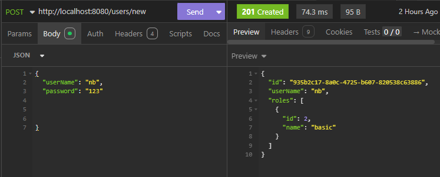
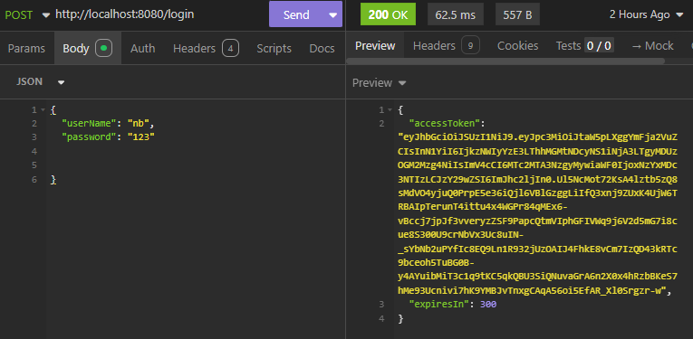

# 🐦 mini-x

O mini-x é uma API REST desenvolvida com **Spring Boot** que implementa uma versão minima da rede social X, com autenticação, persistência de dados em **PostgreSQL**, e empacotamento via **Docker**.

---

## 🧩 Tecnologias Utilizadas

- **Java 21**
- **Spring Boot**
  - Spring Security
  - Spring Data JPA
  - Validation
- **PostgreSQL**
- **Docker / Docker Compose**

---

## ✨ Funconalidades

- Criar conta
- Fazer login
- Fazer posts
- Vizualizar o feed
- Deletar posts
- Listar Usuários

## 📝 Boas Práticas
- Arquitetura em camadas
- DTOS
- Tratamento com handler global
- Exeções personalizadas
- Paginação
- Autenticação/Autorização


## 🚩 Exemplo de Endpoints


  




## 🐳 Executando o Projeto

**obs:** já existe um user do tipo admin cadastrado, experimente fazer login  
userName: admin  
password: 123

### Docker (requisito)
```bash
docker-compose up --build