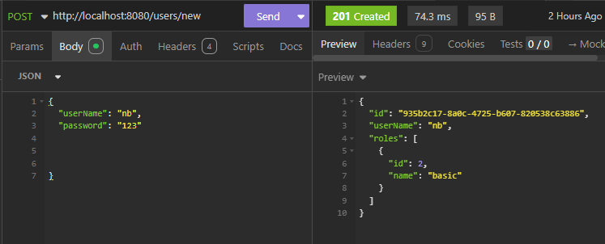
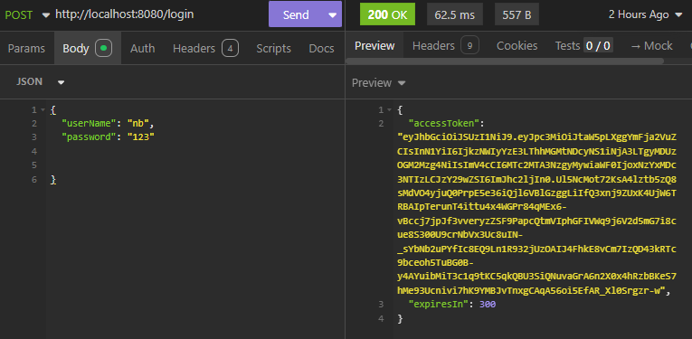

# 🐦 mini-x

O mini-x é uma API REST desenvolvida com **Spring Boot** que implementa uma versão minima da rede social X, com autenticação, persistência de dados em **PostgreSQL**, e empacotamento via **Docker**.

---

## 🧩 Tecnologias Utilizadas

- **Java 21**
- **Spring Boot**
  - Spring Security
  - Spring Data JPA
  - Validation
- **PostgreSQL**
- **Docker / Docker Compose**
- **SvelteKit** (cliente web)

---

## ✨ Funconalidades

- Criar conta
- Fazer login
- Fazer posts
- Vizualizar o feed
- Deletar posts
- Listar Usuários

## 📝 Boas Práticas
- Arquitetura em camadas
- DTOS
- Tratamento com handler global
- Exeções personalizadas
- Paginação
- Autenticação/Autorização

---

## 💻 Cliente Web (Svelte)

Este repositório também contém um cliente web em **SvelteKit** dentro da pasta `frontend/`, que consome a API do mini-x.

### Requisitos

- **Node.js** (versão LTS recomendada)
- **npm** (ou pnpm/yarn, se preferir)

### Como executar o cliente

1. Acesse a pasta do frontend:

   ```bash
   cd frontend
   ```

2. Instale as dependências:

   ```bash
   npm install
   ```

3. Inicie o servidor de desenvolvimento:

   ```bash
   npm run dev
   ```

4. Abra o navegador no endereço indicado pelo terminal (por padrão `http://localhost:5173`).

Certifique-se de que a API do mini-x esteja em execução (via Docker como recomendado abaixo, ou localmente) para que o cliente Svelte consiga se comunicar corretamente.


## 🚩 Exemplo de Endpoints


  




## 🐳 Executando o Projeto

**obs:** já existe um user do tipo admin cadastrado, experimente fazer login  
userName: admin  
password: 123

### Docker (requisito)
```bash
docker-compose up --build
ou
docker compose up --build
